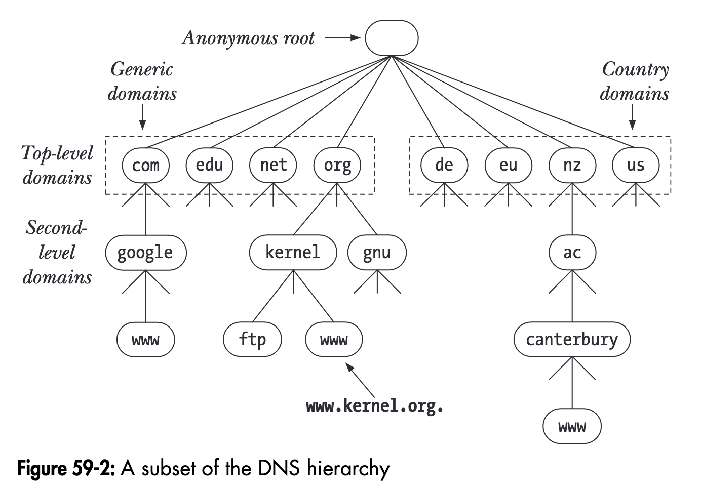

## What is a DNS?
DNS, or Domain Name System, is a decentralized naming system that translates human-readable domain names (like [www.example.com](http://www.example.com)) into numerical IP addresses like `16.07.155.33` , facilitating the routing of information on the internet.
## How DNS actually works?

By calling the `getaddrinfo()` function, it examines the file in `/etc/hosts` to find a match for either the canonical hostname or one of the optional aliases. While this is a sensible approach for a short list of hostnames, it is poorly designed for millions of hosts; DNS was developed to address this very issue.

Hostnames are structured within a hierarchical namespace (see Figure 59-2). Each node in the DNS hierarchy possesses a label (name) that can be up to 63 characters long. At the apex of the hierarchy lies an unnamed node, the "anonymous root."

When searching for a website, let's consider `www.morocco.com` as an example. The DNS first looks in the `/etc/hosts` local file. If the hostname is not found there, it queries the DNS server to determine the IP address of the corresponding website on the internet. It begins by checking for the top-level domain, such as ".com," ".ma," ".es," etc. Subsequently, it searches for the second-level domain, which is `morocco` in our case. After discovering the associated IP address, it determines the appropriate protocol—such as `http`, `ftp`, etc.—to interact with that server.
